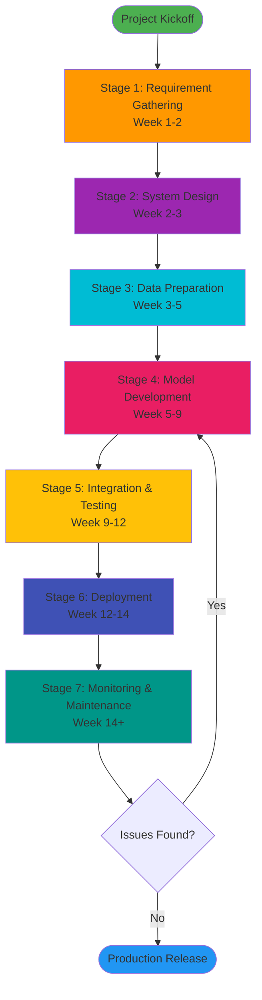
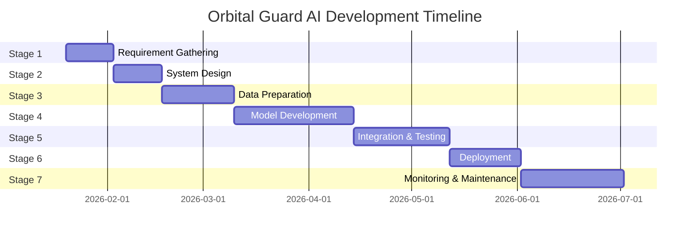

.# Orbital Guard AI - Complete Project Workflow
**End-to-End Development & Deployment Guide**

---

## Document Overview

**Project:** Orbital Guard AI - Space Debris Detection & Collision Avoidance System  
**Document Type:** Complete Development Workflow  
**Version:** 1.0  
**Last Updated:** January 17, 2026  
**Estimated Timeline:** 12-16 weeks (3-4 months)

---

## Table of Contents

1. [Requirement Gathering](#stage-1-requirement-gathering)
2. [System Design](#stage-2-system-design)
3. [Data Preparation](#stage-3-data-preparation)
4. [Model Development](#stage-4-model-development)
5. [Integration & Testing](#stage-5-integration--testing)
6. [Deployment](#stage-6-deployment)
7. [Monitoring & Maintenance](#stage-7-monitoring--maintenance)
8. [Project Timeline](#project-timeline)
9. [Resource Allocation](#resource-allocation)
10. [Success Metrics](#success-metrics)

---

## Workflow Overview Diagram



---

# Stage 1: Requirement Gathering

**Duration:** 2 weeks  
**Team:** Product Manager, Technical Lead, Stakeholders

## 📋 Objectives

1. **Define project scope** and success criteria
2. **Identify target users** and use cases
3. **Document functional requirements** for all features
4. **Establish non-functional requirements** (performance, security, scalability)
5. **Set project constraints** (budget, timeline, resources)
6. **Prioritize features** using MoSCoW method

## ✅ Key Tasks

### Week 1: Stakeholder Analysis & User Research

**Day 1-2: Stakeholder Interviews**
- [ ] Interview satellite operators
- [ ] Consult with space agencies representatives
- [ ] Survey commercial space companies
- [ ] Document pain points and needs

**Day 3-4: Competitive Analysis**
- [ ] Research existing solutions (JSpOC, ESA DRAMA, SOCRATES)
- [ ] Identify market gaps
- [ ] Analyze pricing models
- [ ] Document differentiators

**Day 5: User Personas**
- [ ] Create 3-5 detailed user personas
- [ ] Map user journeys
- [ ] Identify critical workflows

### Week 2: Requirements Documentation

**Day 1-3: Functional Requirements**
- [ ] Real-time satellite tracking specifications
- [ ] Collision detection algorithm requirements
- [ ] Dashboard UI/UX requirements
- [ ] Alert system specifications
- [ ] Reporting and analytics needs

**Day 4-5: Non-Functional Requirements**
- [ ] **Performance:** 60 FPS, <16ms latency
- [ ] **Scalability:** Support 100+ tracked objects
- [ ] **Accuracy:** ±1km precision (SGP4)
- [ ] **Availability:** 99.9% uptime
- [ ] **Security:** Authentication, data encryption
- [ ] **Compliance:** ITAR, export control regulations

## 🛠️ Tools & Technologies

| Category | Tools |
|----------|-------|
| **Documentation** | Confluence, Notion, Google Docs |
| **User Research** | UserTesting.com, Typeform, Zoom |
| **Project Management** | Jira, Trello, Monday.com |
| **Wireframing** | Figma, Sketch, Adobe XD |

## 📦 Expected Deliverables

1. **Product Requirements Document (PRD)**
   - Executive summary
   - Target users and personas
   - Feature list with priorities
   - Success metrics

2. **Technical Requirements Specification (TRS)**
   - System architecture overview
   - Performance benchmarks
   - Security requirements
   - Integration points

3. **User Stories** (50-100 stories)
   - Acceptance criteria
   - Priority rankings
   - Story point estimates

4. **Project Charter**
   - Scope statement
   - Timeline and milestones
   - Budget allocation
   - Risk register

## ⚠️ Risks & Mitigation Strategies

| Risk | Impact | Probability | Mitigation |
|------|--------|-------------|------------|
| **Unclear requirements** | High | Medium | Multiple stakeholder reviews, prototyping |
| **Scope creep** | High | High | Strict change control process, MVP approach |
| **Regulatory compliance unknown** | Medium | Medium | Early consultation with legal/compliance team |
| **Unrealistic performance expectations** | High | Medium | Set benchmarks based on industry standards |
| **Stakeholder misalignment** | High | Low | Regular alignment meetings, shared documentation |

## ✨ Success Criteria

- [ ] All stakeholders sign off on PRD
- [ ] User personas validated with target users
- [ ] Technical feasibility confirmed
- [ ] Budget and timeline approved
- [ ] Risk register documented and accepted

---

# Stage 2: System Design

**Duration:** 2 weeks  
**Team:** Architects, Senior Engineers, UX Designers

## 📋 Objectives

1. **Design system architecture** (frontend, backend, database)
2. **Create detailed UI/UX mockups** for all pages
3. **Define data models** and database schemas
4. **Specify API contracts** and integration points
5. **Design collision detection algorithm** workflow
6. **Plan infrastructure** and deployment strategy

## ✅ Key Tasks

### Week 1: Architecture & Database Design

**Day 1-2: High-Level Architecture**
- [ ] Define microservices vs monolithic approach
- [ ] Design frontend architecture (React component hierarchy)
- [ ] Plan backend services (API server, ML service, data pipeline)
- [ ] Select databases (PostgreSQL for metadata, Redis for caching)
- [ ] Design message queues (RabbitMQ/Kafka for real-time updates)

**Day 3-4: Data Modeling**
- [ ] Design TLE data schema
- [ ] Create satellite object model
- [ ] Define conjunction event structure
- [ ] Plan alert and notification schema
- [ ] Design user and authentication models

**Day 5: API Design**
- [ ] REST API endpoints specification
- [ ] WebSocket protocol for real-time updates
- [ ] GraphQL schema (if applicable)
- [ ] Authentication flow (JWT tokens)
- [ ] Rate limiting and caching strategies

### Week 2: UI/UX & Algorithm Design

**Day 1-3: UI/UX Mockups**
- [ ] Landing page wireframes
- [ ] Dashboard high-fidelity mockups
- [ ] Interactive demo pages (Shader Hero, Sign-In Flow)
- [ ] Mobile responsive designs
- [ ] Style guide and component library

**Day 4-5: Algorithm Design**
- [ ] SGP4 propagation implementation plan
- [ ] Multi-stage collision screening flowchart
- [ ] Foster 3D PoC calculation specification
- [ ] Time-to-conjunction algorithm
- [ ] Alert prioritization logic

## 🛠️ Tools & Technologies

### Frontend Stack
```
- React 18 + TypeScript
- Vite (build tool)
- Tailwind CSS (styling)
- Three.js + WebGL2 (3D visualization)
- Framer Motion (animations)
- React Router (routing)
- Zustand/Redux (state management)
```

### Backend Stack
```
- Python 3.10+ (API server)
- FastAPI (web framework)
- PyTorch (ML models)
- Satellite.js / SGP4 library
- PostgreSQL (database)
- Redis (caching)
- Celery (background tasks)
```

### Infrastructure
```
- Docker (containerization)
- Kubernetes (orchestration)
- AWS/GCP/Azure (cloud provider)
- Nginx (reverse proxy)
- Prometheus + Grafana (monitoring)
```

### Design Tools
```
- Figma (UI/UX design)
- Lucidchart (architecture diagrams)
- Draw.io (flowcharts)
- Mermaid (documentation diagrams)
```

## 📦 Expected Deliverables

1. **System Architecture Document**
   - Component diagram
   - Deployment diagram
   - Data flow diagrams
   - Sequence diagrams for critical flows

2. **Database Schema**
   - ER diagrams
   - Table definitions
   - Index strategies
   - Migration plan

3. **API Specification**
   - OpenAPI/Swagger documentation
   - Request/response examples
   - Error handling specification
   - Authentication flows

4. **UI/UX Design Package**
   - High-fidelity mockups (all screens)
   - Interactive prototypes
   - Component library
   - Design system documentation

5. **Algorithm Design Documents**
   - Pseudocode for collision detection
   - Mathematical formulas (Foster 3D PoC)
   - Performance analysis
   - Test cases

## ⚠️ Risks & Mitigation Strategies

| Risk | Impact | Probability | Mitigation |
|------|--------|-------------|------------|
| **Over-engineering** | Medium | High | Focus on MVP features, iterative design |
| **Technology mismatch** | High | Medium | Proof-of-concept prototypes early |
| **Performance bottlenecks** | High | Medium | Load testing simulations, profiling |
| **UI/UX not user-friendly** | High | Low | User testing with prototypes |
| **Integration complexity** | Medium | Medium | Well-defined API contracts, mocks |

## ✨ Success Criteria

- [ ] Architecture reviewed and approved by tech leads
- [ ] Database schema supports all required queries efficiently
- [ ] API specification covers all functional requirements
- [ ] UI/UX designs validated with 5+ target users
- [ ] Algorithm designs peer-reviewed for correctness

---

# Stage 3: Data Preparation

**Duration:** 2-3 weeks  
**Team:** Data Engineers, ML Engineers, Backend Developers

## 📋 Objectives

1. **Acquire real TLE data** from authoritative sources
2. **Build data ingestion pipeline** for continuous updates
3. **Clean and validate** satellite orbital data
4. **Generate training datasets** for ML models
5. **Create synthetic conjunction events** for testing
6. **Establish data versioning** and lineage tracking

## ✅ Key Tasks

### Week 1: Data Acquisition & Pipeline

**Day 1-2: Data Source Integration**
- [ ] Register with Space-Track.org API
- [ ] Set up CelesTrak data feeds
- [ ] Implement API authentication
- [ ] Build data fetching scripts
- [ ] Schedule automated data updates (every 6-12 hours)

**Day 3-4: Data Ingestion Pipeline**
- [ ] Design ETL (Extract, Transform, Load) workflow
- [ ] Parse TLE format into structured data
- [ ] Validate TLE checksums
- [ ] Store in PostgreSQL database
- [ ] Implement incremental updates

**Day 5: Data Quality Checks**
- [ ] Validate orbital parameters (eccentricity, inclination, etc.)
- [ ] Check for duplicate entries
- [ ] Identify and flag stale data
- [ ] Log data quality metrics

### Week 2: Dataset Creation

**Day 1-3: Historical Data Collection**
- [ ] Gather 6-12 months of historical TLEs
- [ ] Organize by satellite catalog number
- [ ] Track TLE epoch times
- [ ] Build time-series database

**Day 4-5: Synthetic Data Generation**
- [ ] Create synthetic conjunction events
- [ ] Generate close approach scenarios
- [ ] Simulate different miss distances
- [ ] Label collision vs safe pass events

### Week 3: Feature Engineering

**Day 1-2: Orbital Element Features**
- [ ] Extract semi-major axis, eccentricity, inclination
- [ ] Calculate orbital period
- [ ] Determine apogee and perigee
- [ ] Identify orbital regime (LEO, MEO, GEO)

**Day 3-4: Conjunction Features**
- [ ] Calculate relative velocity
- [ ] Compute miss distance
- [ ] Determine time-to-conjunction
- [ ] Extract geometry features (approach angle)

**Day 5: Data Versioning**
- [ ] Set up DVC (Data Version Control)
- [ ] Tag dataset versions
- [ ] Document data transformations
- [ ] Create data catalog

## 🛠️ Tools & Technologies

| Category | Tools |
|----------|-------|
| **Data Sources** | Space-Track.org, CelesTrak, ESA Discos |
| **ETL Pipeline** | Apache Airflow, Prefect, Python scripts |
| **Data Storage** | PostgreSQL, AWS S3, MinIO |
| **Data Quality** | Great Expectations, Pandas Profiling |
| **Versioning** | DVC, MLflow, Git LFS |
| **Processing** | Pandas, NumPy, Dask (for large datasets) |

## 📦 Expected Deliverables

1. **Data Ingestion Pipeline**
   - Automated TLE fetching (runs every 6 hours)
   - Data validation and cleaning scripts
   - Error handling and retry logic
   - Monitoring and alerting

2. **Clean Datasets**
   - **Production TLE Database:** Current orbital data for 18+ satellites
   - **Historical Archive:** 6-12 months of TLE data
   - **Training Dataset:** 10,000+ conjunction events (labeled)
   - **Test Dataset:** 2,000+ hold-out conjunction events

3. **Feature Store**
   - Orbital element features
   - Conjunction event features
   - Satellite metadata (name, type, owner)
   - Feature documentation

4. **Data Quality Reports**
   - Coverage statistics
   - Freshness metrics
   - Validation error rates
   - Data lineage documentation

## ⚠️ Risks & Mitigation Strategies

| Risk | Impact | Probability | Mitigation |
|------|--------|-------------|------------|
| **API rate limiting** | Medium | High | Cache data, multiple API keys, staggered requests |
| **Data quality issues** | High | Medium | Automated validation, manual spot checks |
| **Insufficient training data** | High | Medium | Synthetic data generation, data augmentation |
| **Regulatory restrictions (ITAR)** | High | Low | Legal review, use only public data |
| **Data pipeline failures** | Medium | Medium | Robust error handling, monitoring, alerts |

## ✨ Success Criteria

- [ ] TLE data pipeline runs reliably (99%+ uptime)
- [ ] Database contains current data for 18+ satellites
- [ ] Training dataset has 10,000+ labeled conjunction events
- [ ] Data quality metrics meet thresholds (>95% valid)
- [ ] Feature engineering pipeline is reproducible

---

# Stage 4: Model Development

**Duration:** 4-5 weeks  
**Team:** ML Engineers, Data Scientists, Algorithm Developers

## 📋 Objectives

1. **Implement SGP4 orbital propagation** for real-time tracking
2. **Develop collision detection algorithm** (multi-stage screening)
3. **Train ML model** for collision probability prediction
4. **Optimize algorithm performance** for real-time operation
5. **Validate model accuracy** against ground truth
6. **Create model versioning** and experiment tracking

## ✅ Key Tasks

### Week 1: SGP4 Implementation

**Day 1-2: SGP4 Integration**
- [ ] Integrate `satellite.js` library (frontend)
- [ ] Implement Python SGP4 wrapper (backend)
- [ ] Test propagation accuracy
- [ ] Optimize for batch processing

**Day 3-4: Orbital Mechanics**
- [ ] Calculate orbital positions (ECI coordinates)
- [ ] Convert ECI to ECEF (Earth-fixed frame)
- [ ] Implement coordinate transformations
- [ ] Validate against known satellite positions

**Day 5: Performance Optimization**
- [ ] Profile propagation speed
- [ ] Implement caching strategies
- [ ] Parallelize batch propagation
- [ ] Achieve <1ms per object propagation

### Week 2: Collision Detection Algorithm

**Day 1-2: Multi-Stage Screening**
- [ ] **Stage 1:** Voxel grid spatial indexing
- [ ] **Stage 2:** AABB bounding box tests
- [ ] **Stage 3:** Ellipsoidal shell intersection

**Day 3-4: Probability of Collision**
- [ ] Implement Foster 3D PoC algorithm
- [ ] Calculate covariance ellipsoids
- [ ] Determine conjunction geometry
- [ ] Estimate miss distance uncertainty

**Day 5: Time-to-Conjunction**
- [ ] Predict close approach windows
- [ ] Calculate TCA (Time of Closest Approach)
- [ ] Determine conjunction duration
- [ ] Prioritize alerts by urgency

### Week 3-4: Machine Learning Model

**Day 1-3: Model Architecture**
- [ ] Design neural network architecture
  - Input: Orbital elements, relative velocity, geometry
  - Hidden layers: 3-5 dense layers with dropout
  - Output: Collision probability (0-1)
- [ ] Implement in PyTorch
- [ ] Define loss function (binary cross-entropy)
- [ ] Set up training pipeline

**Day 4-7: Model Training**
- [ ] Split data (80% train, 10% validation, 10% test)
- [ ] Train baseline model
- [ ] Hyperparameter tuning (learning rate, batch size, layers)
- [ ] Implement early stopping
- [ ] Track experiments in MLflow

**Day 8-10: Model Evaluation**
- [ ] Calculate accuracy, precision, recall, F1-score
- [ ] Plot ROC curve and AUC
- [ ] Analyze confusion matrix
- [ ] Test on hold-out dataset
- [ ] Compare with rule-based baseline

### Week 5: Optimization & Validation

**Day 1-2: Performance Optimization**
- [ ] Model quantization for inference speed
- [ ] ONNX export for cross-platform compatibility
- [ ] GPU acceleration setup
- [ ] Batch inference optimization

**Day 3-4: Validation & Testing**
- [ ] Cross-validation (5-fold)
- [ ] Test on historical conjunction events
- [ ] Sensitivity analysis
- [ ] Edge case testing

**Day 5: Model Packaging**
- [ ] Export final model weights
- [ ] Create model serving API
- [ ] Document model assumptions
- [ ] Write inference examples

## 🛠️ Tools & Technologies

### Orbital Mechanics
```
- satellite.js (JavaScript SGP4)
- Python SGP4 library
- NumPy (numerical computations)
- SciPy (coordinate transformations)
```

### Machine Learning
```
- PyTorch (deep learning framework)
- Scikit-learn (preprocessing, metrics)
- MLflow (experiment tracking)
- Optuna (hyperparameter tuning)
- ONNX (model export)
```

### Development
```
- Jupyter Notebooks (experimentation)
- VS Code (coding)
- Git (version control)
- Docker (containerization)
```

### Testing
```
- pytest (unit tests)
- hypothesis (property-based tests)
- coverage.py (code coverage)
```

## 📦 Expected Deliverables

1. **SGP4 Propagation Module**
   - Python and JavaScript implementations
   - Unit tests (>90% coverage)
   - Performance benchmarks
   - API documentation

2. **Collision Detection System**
   - Multi-stage screening algorithm
   - Foster 3D PoC implementation
   - Test suite with known scenarios
   - Performance profiling report

3. **Trained ML Model**
   - Final model weights
   - Training metrics and plots
   - Model card documentation
   - Inference API

4. **Model Performance Report**
   - Accuracy: >90%
   - Precision: >85%
   - Recall: >85%
   - F1-Score: >85%
   - ROC AUC: >0.90

5. **Algorithm Documentation**
   - Mathematical formulas
   - Implementation details
   - Validation results
   - Known limitations

## ⚠️ Risks & Mitigation Strategies

| Risk | Impact | Probability | Mitigation |
|------|--------|-------------|------------|
| **SGP4 accuracy degradation** | High | Medium | Validate with recent TLEs, document accuracy limits |
| **Model overfitting** | High | High | Regularization, dropout, cross-validation |
| **Insufficient training data** | High | Medium | Data augmentation, synthetic data generation |
| **Real-time performance issues** | High | Medium | Profiling, optimization, GPU acceleration |
| **Algorithm complexity** | Medium | Low | Code reviews, comprehensive testing |

## ✨ Success Criteria

- [ ] SGP4 propagation achieves ±1km accuracy
- [ ] Collision detection runs in <100ms for 18 objects
- [ ] ML model achieves >90% accuracy on test set
- [ ] False positive rate <5%
- [ ] False negative rate <2%
- [ ] All algorithms have >90% code coverage

---

# Stage 5: Integration & Testing

**Duration:** 3-4 weeks  
**Team:** Full Stack Developers, QA Engineers, DevOps

## 📋 Objectives

1. **Integrate frontend and backend** components
2. **Connect 3D visualization** with real-time orbital data
3. **Implement authentication** and user management
4. **Build alert system** with notifications
5. **Conduct comprehensive testing** (unit, integration, E2E)
6. **Perform load and performance testing**

## ✅ Key Tasks

### Week 1: Frontend-Backend Integration

**Day 1-2: API Integration**
- [ ] Connect React frontend to FastAPI backend
- [ ] Implement API client with error handling
- [ ] Set up WebSocket connection for real-time updates
- [ ] Test all API endpoints

**Day 3-4: 3D Visualization Integration**
- [ ] Connect Three.js scene to orbital data
- [ ] Implement real-time position updates
- [ ] Add orbit trail visualization
- [ ] Synchronize time controls with backend

**Day 5: State Management**
- [ ] Set up global state (Zustand/Redux)
- [ ] Implement data caching strategies
- [ ] Handle loading and error states
- [ ] Optimize re-rendering

### Week 2: Feature Implementation

**Day 1-2: Authentication System**
- [ ] Implement JWT token generation (backend)
- [ ] Build login/logout flows (frontend)
- [ ] Add protected routes
- [ ] Implement session management

**Day 3-4: Alert System**
- [ ] Real-time conjunction alert notifications
- [ ] Email notifications (SendGrid/AWS SES)
- [ ] In-app notification center
- [ ] Alert prioritization and filtering

**Day 5: Dashboard Features**
- [ ] Satellite selection and details panel
- [ ] Time scrubbing and playback controls
- [ ] Collision alert timeline
- [ ] Export functionality (CSV, JSON)

### Week 3: Testing

**Day 1-2: Unit Testing**
- [ ] Frontend component tests (React Testing Library)
- [ ] Backend API tests (pytest)
- [ ] Model inference tests
- [ ] Algorithm correctness tests

**Day 3-4: Integration Testing**
- [ ] API integration tests
- [ ] Database integration tests
- [ ] WebSocket communication tests
- [ ] End-to-end user flows

**Day 5: End-to-End Testing**
- [ ] Set up Playwright/Cypress
- [ ] Write E2E test scenarios
- [ ] Test critical user journeys
- [ ] Cross-browser testing

### Week 4: Performance & Security Testing

**Day 1-2: Load Testing**
- [ ] Set up Locust/k6 for load testing
- [ ] Simulate 100+ concurrent users
- [ ] Test API endpoint throughput
- [ ] Identify bottlenecks

**Day 3: Performance Optimization**
- [ ] Frontend bundle size optimization
- [ ] Code splitting and lazy loading
- [ ] API response caching
- [ ] Database query optimization

**Day 4-5: Security Testing**
- [ ] Authentication bypass testing
- [ ] SQL injection testing
- [ ] XSS vulnerability scanning
- [ ] HTTPS enforcement
- [ ] Security headers configuration

## 🛠️ Tools & Technologies

### Testing Frameworks
```
Frontend:
- Jest (unit tests)
- React Testing Library (component tests)
- Cypress / Playwright (E2E tests)

Backend:
- pytest (unit and integration tests)
- pytest-asyncio (async tests)
- Locust / k6 (load testing)
```

### CI/CD
```
- GitHub Actions / GitLab CI
- Docker (containerization)
- Docker Compose (local testing)
- SonarQube (code quality)
```

### Monitoring & Debugging
```
- Chrome DevTools (frontend debugging)
- Python debugger (pdb, ipdb)
- Network tab (API inspection)
- React DevTools
```

## 📦 Expected Deliverables

1. **Integrated Application**
   - Fully functional frontend-backend connection
   - Real-time data updates working
   - All features implemented
   - Responsive UI across devices

2. **Test Suites**
   - **Frontend:** 100+ unit tests, 20+ component tests
   - **Backend:** 150+ unit tests, 30+ integration tests
   - **E2E:** 15+ critical user flow tests
   - **Code Coverage:** >80% overall

3. **Performance Report**
   - Page load time: <3 seconds
   - API response time: <200ms (p95)
   - 3D rendering: 60 FPS
   - Concurrent users supported: 100+

4. **Security Audit Report**
   - Vulnerability scan results
   - Penetration testing findings
   - Remediation plan
   - Security checklist

5. **Test Documentation**
   - Test plan
   - Test cases and scenarios
   - Bug reports and resolution
   - Regression test suite

## ⚠️ Risks & Mitigation Strategies

| Risk | Impact | Probability | Mitigation |
|------|--------|-------------|------------|
| **Integration bugs** | High | High | Incremental integration, automated tests |
| **Performance degradation** | High | Medium | Load testing, profiling, optimization |
| **Security vulnerabilities** | Critical | Medium | Security audits, penetration testing |
| **Cross-browser compatibility** | Medium | Medium | Automated cross-browser testing |
| **Flaky tests** | Medium | High | Test isolation, retry mechanisms, fix root causes |

## ✨ Success Criteria

- [ ] All API endpoints tested and working
- [ ] 3D visualization updates in real-time (<16ms)
- [ ] Authentication system secure (no vulnerabilities)
- [ ] Test coverage >80%
- [ ] Zero critical bugs
- [ ] Performance benchmarks met (60 FPS, <200ms API)
- [ ] Load testing: 100+ concurrent users supported

---

# Stage 6: Deployment

**Duration:** 2-3 weeks  
**Team:** DevOps Engineers, Backend Developers, SRE

## 📋 Objectives

1. **Set up production infrastructure** (cloud provider)
2. **Configure CI/CD pipelines** for automated deployment
3. **Deploy application** to staging and production environments
4. **Set up monitoring and logging** systems
5. **Configure auto-scaling** and load balancing
6. **Implement disaster recovery** and backup strategies

## ✅ Key Tasks

### Week 1: Infrastructure Setup

**Day 1-2: Cloud Provider Configuration**
- [ ] Choose cloud provider (AWS/GCP/Azure)
- [ ] Set up VPC and networking
- [ ] Configure security groups and firewalls
- [ ] Provision compute instances (EC2/GCE/VMs)
- [ ] Set up managed databases (RDS/Cloud SQL)

**Day 3-4: Container Orchestration**
- [ ] Set up Kubernetes cluster (EKS/GKE/AKS)
- [ ] Configure namespaces (staging, production)
- [ ] Set up ingress controller (Nginx/Traefik)
- [ ] Configure SSL/TLS certificates (Let's Encrypt)
- [ ] Set up secrets management (Vault/AWS Secrets Manager)

**Day 5: Storage & CDN**
- [ ] Configure object storage (S3/GCS/Azure Blob)
- [ ] Set up CDN (CloudFront/Cloud CDN)
- [ ] Configure static asset serving
- [ ] Set up backup storage

### Week 2: CI/CD & Deployment

**Day 1-2: CI/CD Pipeline**
- [ ] Configure GitHub Actions / GitLab CI
- [ ] Set up build pipeline (Docker image builds)
- [ ] Implement automated testing in pipeline
- [ ] Configure deployment stages (dev → staging → production)

**Day 3: Staging Deployment**
- [ ] Deploy to staging environment
- [ ] Run smoke tests
- [ ] Test database migrations
- [ ] Verify integrations

**Day 4-5: Production Deployment**
- [ ] Blue-green deployment setup
- [ ] Deploy to production
- [ ] DNS configuration
- [ ] SSL certificate validation
- [ ] Health check verification

### Week 3: Monitoring & Optimization

**Day 1-2: Monitoring Setup**
- [ ] Set up Prometheus for metrics
- [ ] Configure Grafana dashboards
- [ ] Implement application logging (ELK stack)
- [ ] Set up error tracking (Sentry)
- [ ] Configure uptime monitoring (Pingdom/UptimeRobot)

**Day 3: Alerting Configuration**
- [ ] Set up PagerDuty / OpsGenie
- [ ] Configure alert rules (CPU, memory, errors)
- [ ] Set up notification channels (Slack, email)
- [ ] Test alerting workflows

**Day 4-5: Auto-Scaling & Load Balancing**
- [ ] Configure horizontal pod autoscaling (HPA)
- [ ] Set up load balancer
- [ ] Test auto-scaling behavior
- [ ] Optimize resource requests/limits

## 🛠️ Tools & Technologies

### Cloud Platforms
```
- AWS (EC2, RDS, S3, CloudFront, Route53)
- GCP (GCE, Cloud SQL, GCS, Cloud CDN)
- Azure (VMs, Azure SQL, Blob Storage, CDN)
```

### Container & Orchestration
```
- Docker (containerization)
- Kubernetes (orchestration)
- Helm (package management)
- kubectl (cluster management)
```

### CI/CD
```
- GitHub Actions
- GitLab CI/CD
- Jenkins
- ArgoCD (GitOps)
```

### Monitoring & Logging
```
- Prometheus (metrics)
- Grafana (visualization)
- ELK Stack (logging)
- Sentry (error tracking)
- Datadog / New Relic (APM)
```

## 📦 Expected Deliverables

1. **Production Infrastructure**
   - Fully configured cloud environment
   - Kubernetes cluster operational
   - Database instances running
   - CDN configured

2. **CI/CD Pipeline**
   - Automated build and test
   - Multi-stage deployment (dev → staging → prod)
   - Rollback capabilities
   - Deployment documentation

3. **Deployed Application**
   - Staging environment: `https://staging.orbitalguard.ai`
   - Production environment: `https://orbitalguard.ai`
   - SSL certificates active
   - DNS configured

4. **Monitoring Dashboards**
   - System metrics (CPU, memory, disk)
   - Application metrics (requests, errors, latency)
   - Business metrics (active users, alerts triggered)
   - Custom dashboards

5. **Runbooks & Documentation**
   - Deployment procedures
   - Rollback procedures
   - Incident response playbooks
   - Architecture diagrams

## ⚠️ Risks & Mitigation Strategies

| Risk | Impact | Probability | Mitigation |
|------|--------|-------------|------------|
| **Deployment failures** | High | Medium | Blue-green deployment, rollback plan |
| **Downtime** | Critical | Low | Zero-downtime deployment, health checks |
| **Data loss** | Critical | Low | Automated backups, point-in-time recovery |
| **Security breach** | Critical | Low | Security hardening, penetration testing |
| **Cost overrun** | Medium | Medium | Cost monitoring, budget alerts |
| **DNS propagation delay** | Low | Medium | Pre-configure DNS, use low TTLs initially |

## ✨ Success Criteria

- [ ] Application accessible at production URL
- [ ] SSL/TLS certificate valid
- [ ] Auto-scaling working (tested)
- [ ] Monitoring dashboards operational
- [ ] Alerting tested and functional
- [ ] Deployment time <15 minutes
- [ ] Zero-downtime deployment verified
- [ ] Backup and restore tested

---

# Stage 7: Monitoring & Maintenance

**Duration:** Ongoing (post-launch)  
**Team:** SRE, DevOps, Support Engineers, Development Team

## 📋 Objectives

1. **Monitor system health** and performance 24/7
2. **Respond to incidents** and outages promptly
3. **Implement continuous improvements** based on metrics
4. **Maintain and update dependencies** regularly
5. **Provide user support** and bug fixes
6. **Plan and execute feature enhancements**

## ✅ Key Tasks

### Daily Operations

**Monitoring**
- [ ] Review dashboard metrics (every 4 hours)
- [ ] Check error logs and rates
- [ ] Verify data pipeline health
- [ ] Monitor user activity and engagement
- [ ] Track cost and resource utilization

**Incident Response**
- [ ] Acknowledge alerts within 5 minutes
- [ ] Triage and assign severity
- [ ] Investigate root cause
- [ ] Implement fix or mitigation
- [ ] Post-incident review and documentation

### Weekly Maintenance

**Performance Optimization**
- [ ] Review slow queries and optimize
- [ ] Analyze bundle size and optimize
- [ ] Check cache hit rates
- [ ] Identify and fix memory leaks

**Security Updates**
- [ ] Review security advisories
- [ ] Update dependencies with patches
- [ ] Run vulnerability scans
- [ ] Review access logs for anomalies

**Data Management**
- [ ] Verify TLE data freshness
- [ ] Clean up old logs and data
- [ ] Check database backups
- [ ] Monitor storage usage

### Monthly Tasks

**Feature Enhancements**
- [ ] Review user feedback and feature requests
- [ ] Prioritize backlog items
- [ ] Plan sprint for new features
- [ ] Release updates

**Capacity Planning**
- [ ] Review traffic trends
- [ ] Forecast resource needs
- [ ] Optimize costs
- [ ] Plan infrastructure scaling

**Compliance & Audits**
- [ ] Review access controls
- [ ] Audit security logs
- [ ] Update documentation
- [ ] Compliance checks (GDPR, ITAR, etc.)

### Quarterly Reviews

**System Health Assessment**
- [ ] Comprehensive performance review
- [ ] Technical debt analysis
- [ ] Architecture review
- [ ] Disaster recovery drill

**User Feedback Analysis**
- [ ] Analyze support tickets
- [ ] Review user surveys
- [ ] Identify pain points
- [ ] Plan UX improvements

## 🛠️ Tools & Technologies

### Monitoring & Alerting
```
- Prometheus + Grafana (metrics)
- ELK Stack (logs)
- Sentry (errors)
- PagerDuty (incident management)
- UptimeRobot (uptime monitoring)
```

### Support & Communication
```
- Zendesk / Freshdesk (ticketing)
- Slack (team communication)
- StatusPage (status updates)
- Intercom (user chat support)
```

### Analytics
```
- Google Analytics (web analytics)
- Mixpanel (product analytics)
- Hotjar (user behavior)
```

## 📦 Expected Deliverables

### Ongoing Deliverables

1. **Incident Reports**
   - Root cause analysis
   - Remediation steps
   - Prevention measures
   - Post-mortem documentation

2. **Performance Reports (Monthly)**
   - Uptime percentage (target: 99.9%)
   - Average response time
   - Error rates
   - User engagement metrics

3. **Feature Releases (Bi-weekly/Monthly)**
   - Release notes
   - Changelog
   - Migration guides
   - User documentation

4. **Security Patches (As Needed)**
   - Vulnerability fixes
   - Dependency updates
   - Security audit reports

5. **Quarterly Business Reviews**
   - System health summary
   - User growth trends
   - Feature adoption metrics
   - Roadmap updates

## ⚠️ Risks & Mitigation Strategies

| Risk | Impact | Probability | Mitigation |
|------|--------|-------------|------------|
| **Service outage** | Critical | Low | Redundancy, auto-scaling, incident response plan |
| **Data corruption** | Critical | Very Low | Regular backups, validation checks, ACID transactions |
| **Security breach** | Critical | Low | Security monitoring, penetration testing, rapid patching |
| **Performance degradation** | High | Medium | Proactive monitoring, load testing, optimization |
| **Dependency vulnerabilities** | High | Medium | Automated security scanning, regular updates |
| **Team burnout** | Medium | Medium | On-call rotation, runbooks, automation |

## ✨ Success Criteria

### Service Level Objectives (SLOs)

- [ ] **Availability:** 99.9% uptime (max 43 minutes downtime/month)
- [ ] **Performance:** 
  - Page load time: <3 seconds (p95)
  - API response: <200ms (p95)
  - 3D rendering: 60 FPS
- [ ] **Reliability:**
  - Error rate: <0.1%
  - Failed requests: <0.5%
- [ ] **Data Freshness:**
  - TLE updates: Every 6 hours
  - Orbital positions: Real-time (<1 second lag)
- [ ] **Support:**
  - Incident response time: <15 minutes
  - Critical bug fixes: <24 hours
  - Feature requests reviewed: Weekly

### Key Performance Indicators (KPIs)

- **User Growth:** 20% month-over-month
- **User Retention:** >80% weekly active users
- **System Uptime:** >99.9%
- **Customer Satisfaction:** >4.5/5 stars
- **Support Ticket Resolution:** <48 hours average

---

# Project Timeline

## Gantt Chart Overview



## Milestone Schedule

| Milestone | Target Date | Description |
|-----------|-------------|-------------|
| **M1: Requirements Finalized** | Week 2 | PRD and TRS approved |
| **M2: Design Complete** | Week 4 | Architecture and UI/UX finalized |
| **M3: Data Pipeline Live** | Week 6 | TLE data ingestion operational |
| **M4: ML Model Trained** | Week 10 | Collision prediction model ready |
| **M5: Integration Complete** | Week 13 | All components integrated |
| **M6: Testing Complete** | Week 14 | All tests passed, ready for deployment |
| **M7: Staging Deployment** | Week 15 | Staging environment live |
| **M8: Production Launch** | Week 16 | Public release 🚀 |

---

# Resource Allocation

## Team Structure

### Core Team (12-15 people)

**Engineering (8-10 people)**
- 1 Technical Lead / Architect
- 2 Frontend Developers (React, Three.js)
- 2 Backend Developers (Python, FastAPI)
- 2 ML Engineers (PyTorch, algorithms)
- 1 DevOps / SRE Engineer
- 1-2 QA Engineers

**Product & Design (2-3 people)**
- 1 Product Manager
- 1 UX/UI Designer
- 1 Technical Writer (documentation)

**Operations (1-2 people)**
- 1 Data Engineer
- 0.5 Security Engineer (part-time/consultant)

### Budget Allocation

| Category | Monthly Cost | Notes |
|----------|--------------|-------|
| **Personnel** | $80,000 - $120,000 | Salaries for 12-15 team members |
| **Cloud Infrastructure** | $2,000 - $5,000 | AWS/GCP costs (scales with usage) |
| **External APIs** | $500 - $1,000 | Space-Track.org, third-party services |
| **Tools & Software** | $1,000 - $2,000 | Licenses, SaaS subscriptions |
| **Contingency** | $5,000 | Unexpected costs |
| **Total** | **$88,500 - $133,000** | Per month |

**Project Budget (4 months):** $350,000 - $530,000

---

# Success Metrics

## Technical Metrics

| Metric | Target | Measurement |
|--------|--------|-------------|
| **SGP4 Accuracy** | ±1km | Comparison with ground truth |
| **Collision Detection Speed** | <100ms for 18 objects | Performance profiling |
| **ML Model Accuracy** | >90% | Test dataset evaluation |
| **API Response Time** | <200ms (p95) | Application monitoring |
| **3D Rendering FPS** | 60 FPS | Browser performance tools |
| **System Uptime** | 99.9% | Uptime monitoring |
| **Code Coverage** | >80% | Automated test tools |

## Business Metrics

| Metric | Target | Timeline |
|--------|--------|----------|
| **Beta Users** | 50+ | Month 4 |
| **Active Users** | 200+ | Month 6 |
| **User Retention** | >70% | Month 6 |
| **Feature Adoption** | >60% use dashboard | Month 6 |
| **Customer Satisfaction** | >4.5/5 stars | Month 6 |
| **Revenue** (if applicable) | $10k MRR | Month 12 |

## User Experience Metrics

| Metric | Target |
|--------|--------|
| **Page Load Time** | <3 seconds |
| **Time to Interactive** | <5 seconds |
| **Task Completion Rate** | >90% |
| **User Error Rate** | <5% |
| **Support Tickets** | <10 per week |

---

# Risk Register

## High-Priority Risks

| Risk ID | Risk Description | Impact | Probability | Owner | Mitigation Strategy |
|---------|------------------|--------|-------------|-------|---------------------|
| R-001 | Regulatory compliance (ITAR) | Critical | Low | Legal/PM | Early legal review, use only public data |
| R-002 | Performance not meeting 60 FPS | High | Medium | Tech Lead | Early profiling, GPU optimization |
| R-003 | TLE data source unavailable | High | Low | Data Engineer | Multiple data sources, caching |
| R-004 | ML model accuracy below target | High | Medium | ML Lead | More training data, ensemble methods |
| R-005 | Security vulnerability | Critical | Medium | Security/DevOps | Regular audits, penetration testing |
| R-006 | Scope creep delays launch | High | High | PM | Strict change control, MVP focus |
| R-007 | Team turnover | Medium | Medium | PM/HR | Knowledge documentation, pair programming |
| R-008 | Cloud cost overrun | Medium | Medium | DevOps | Cost monitoring, auto-scaling policies |

---

# Conclusion

This workflow provides a comprehensive roadmap for developing, deploying, and maintaining the **Orbital Guard AI** platform. Each stage builds upon the previous one, with clear objectives, deliverables, and success criteria.

## Key Takeaways

- **Timeline:** 16 weeks (4 months) from requirements to production launch
- **Team:** 12-15 people across engineering, product, and operations
- **Budget:** $350k - $530k for initial development
- **Iterative Approach:** Continuous improvement post-launch
- **Risk Management:** Proactive identification and mitigation

## Next Steps

1. **Review this workflow** with stakeholders
2. **Assemble the team** and assign roles
3. **Set up project management tools** (Jira, Confluence)
4. **Begin Stage 1:** Requirement gathering
5. **Schedule weekly syncs** and milestone reviews

---

**Document Version:** 1.0  
**Last Updated:** January 17, 2026  
**Maintained by:** Project Management Office  
**Next Review:** End of Stage 1 (Week 2)

---

## Appendix A: Glossary

- **SGP4:** Simplified General Perturbations 4 - orbital propagation algorithm
- **TLE:** Two-Line Element - standardized satellite orbital data format
- **PoC:** Probability of Collision
- **AABB:** Axis-Aligned Bounding Box
- **ECI:** Earth-Centered Inertial coordinate frame
- **ECEF:** Earth-Centered Earth-Fixed coordinate frame
- **TCA:** Time of Closest Approach
- **LEO:** Low Earth Orbit (160-2,000 km altitude)
- **ITAR:** International Traffic in Arms Regulations

## Appendix B: References

- Space-Track.org API Documentation
- CelesTrak TLE data sources
- SGP4 algorithm specification (Vallado et al.)
- Foster 3D PoC calculation method
- React + TypeScript best practices
- PyTorch documentation
- Kubernetes deployment guides

---

**End of Document**
