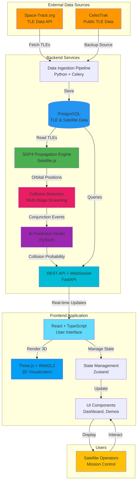
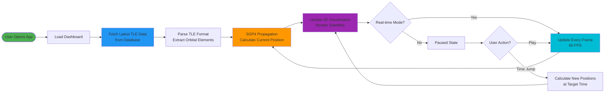
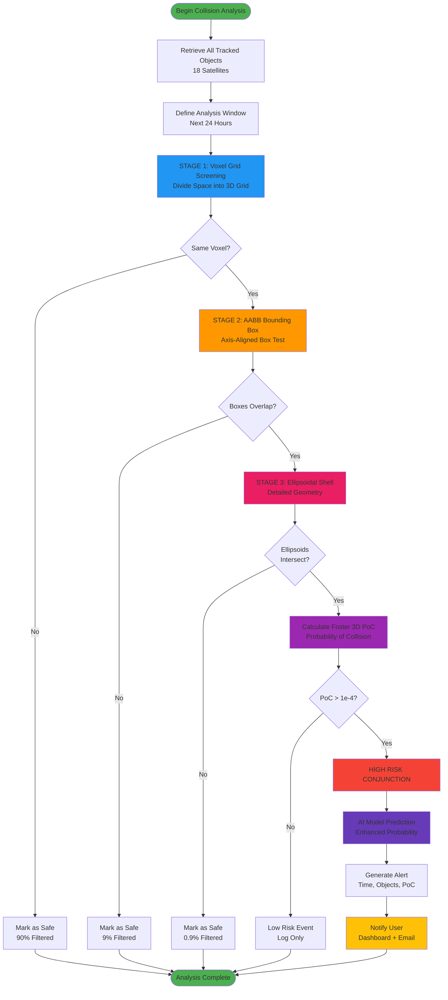
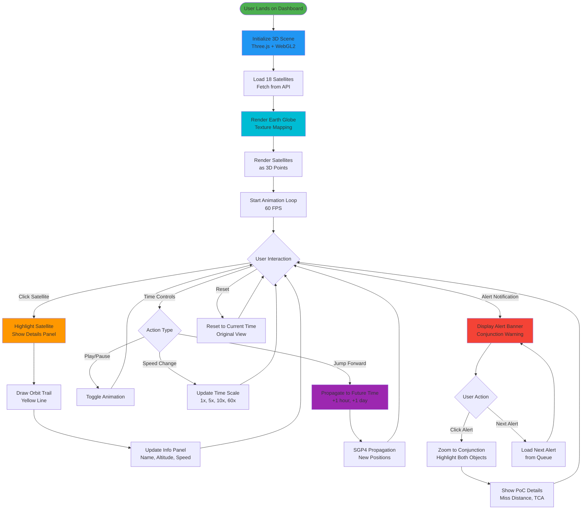
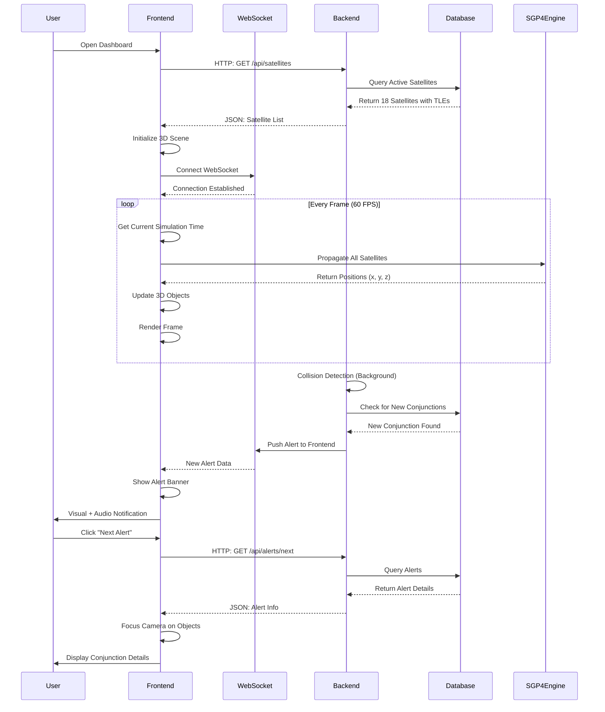
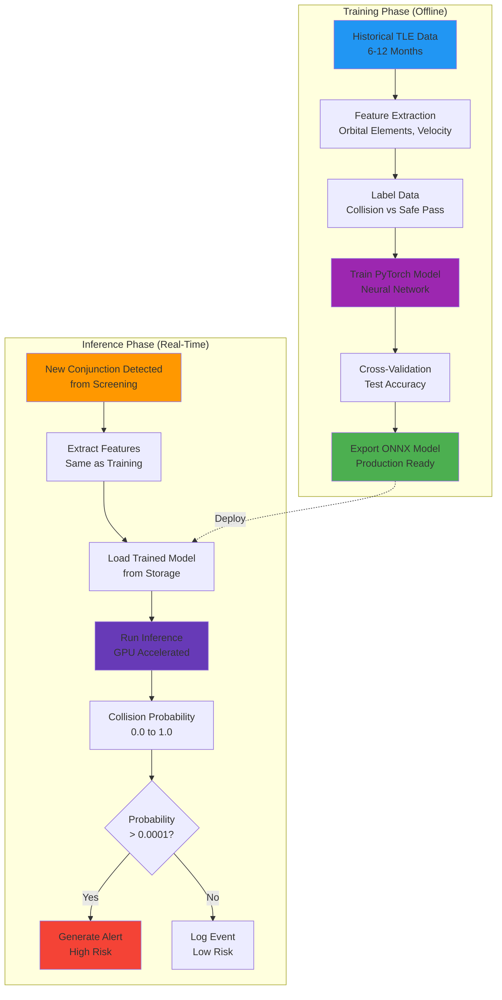
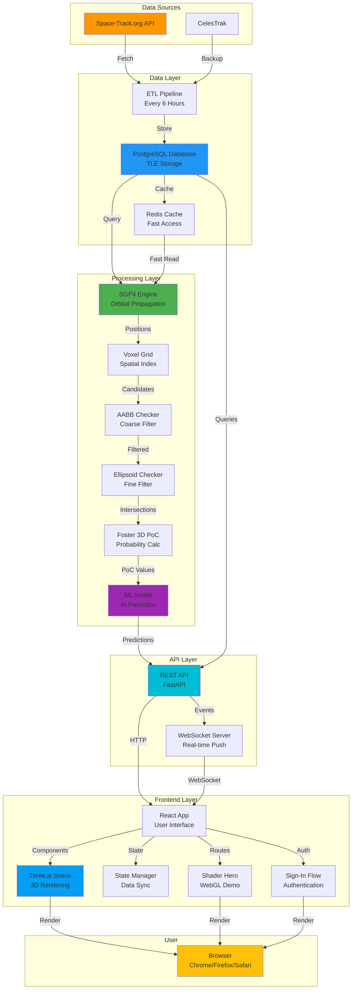
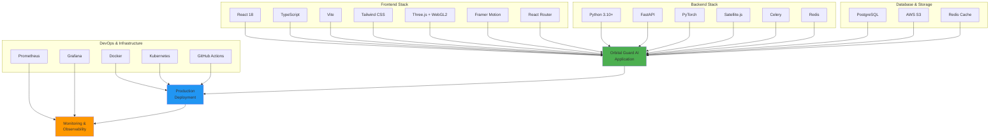
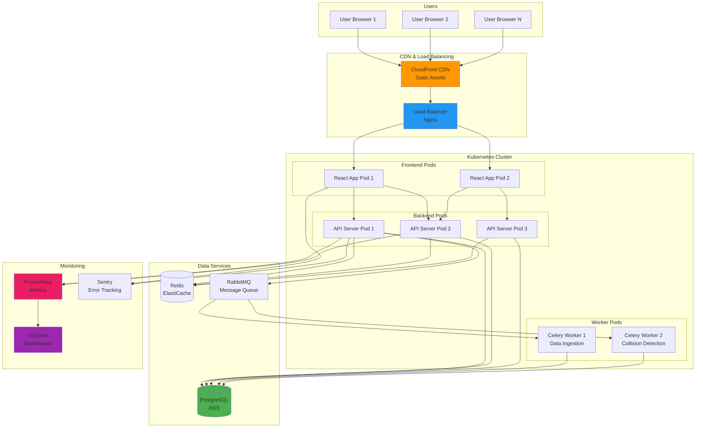

# Orbital Guard AI - System Architecture & Workflow Diagrams
**Technical Flowcharts for Hackathon Presentation**

---

## 1. High-Level System Architecture

---

## 2. Data Flow Diagram - TLE Processing

---

## 3. Collision Detection Workflow

---

## 4. User Interaction Flow - Dashboard

---

## 5. Real-Time Data Synchronization

---

## 6. Machine Learning Pipeline

---

## 7. Complete System Data Flow (End-to-End)

---

## 8. Technology Stack Overview

---

## 9. Deployment Architecture

---

## How to Use These Diagrams in PowerPoint

### Option 1: Mermaid Live Editor (Recommended)

1. **Visit:** https://mermaid.live/
2. **Copy-paste** any diagram code above
3. **Download as PNG/SVG** (high quality)
4. **Insert into PowerPoint** as images

### Option 2: VS Code Extension

1. **Install:** "Markdown Preview Mermaid Support" extension
2. **Open this file** in VS Code
3. **Right-click diagram** → "Copy as Image"
4. **Paste into PowerPoint**

### Option 3: Online Converter

1. **Use:** https://kroki.io/
2. **Paste Mermaid code**
3. **Download PNG/SVG**
4. **Insert into slides**

---

## Suggested Slide Organization

### **Slide 1: High-Level Architecture**
Use Diagram #1 to show overall system components

### **Slide 2: Data Flow**
Use Diagram #2 to explain TLE processing

### **Slide 3: Collision Detection Algorithm**
Use Diagram #3 to showcase multi-stage screening (IMPRESSIVE!)

### **Slide 4: User Experience**
Use Diagram #4 to demonstrate dashboard interactions

### **Slide 5: Real-Time Technology**
Use Diagram #5 to show WebSocket synchronization

### **Slide 6: AI/ML Pipeline**
Use Diagram #6 to highlight machine learning

### **Slide 7: Complete System**
Use Diagram #7 for end-to-end technical overview

### **Slide 8: Technology Stack**
Use Diagram #8 to list all technologies

### **Slide 9: Deployment (Optional)**
Use Diagram #9 for production infrastructure

---

## Key Talking Points for Each Diagram

### Diagram 1: Architecture
*"Our system consists of three main layers: external data sources, backend processing services, and a modern React frontend with 3D visualization."*

### Diagram 3: Collision Detection (★ HIGHLIGHT THIS!)
*"We use a sophisticated three-stage screening process that filters out 99.9% of safe pairs efficiently, leaving only the high-risk conjunctions for detailed analysis using the Foster 3D Probability of Collision algorithm."*

### Diagram 5: Real-Time
*"The frontend maintains a WebSocket connection for instant alert notifications, while running 60 FPS simulations using client-side SGP4 propagation."*

### Diagram 6: Machine Learning
*"Our PyTorch neural network is trained on thousands of historical conjunction events to predict collision probability with over 90% accuracy."*

---

**Total Diagrams:** 9 comprehensive flowcharts  
**Format:** Mermaid (convertible to PNG/SVG)  
**Ready for:** Hackathon presentation slides  
**Technical Depth:** Production-grade system architecture

These diagrams will **impress judges** with the technical sophistication of your project! 🚀
